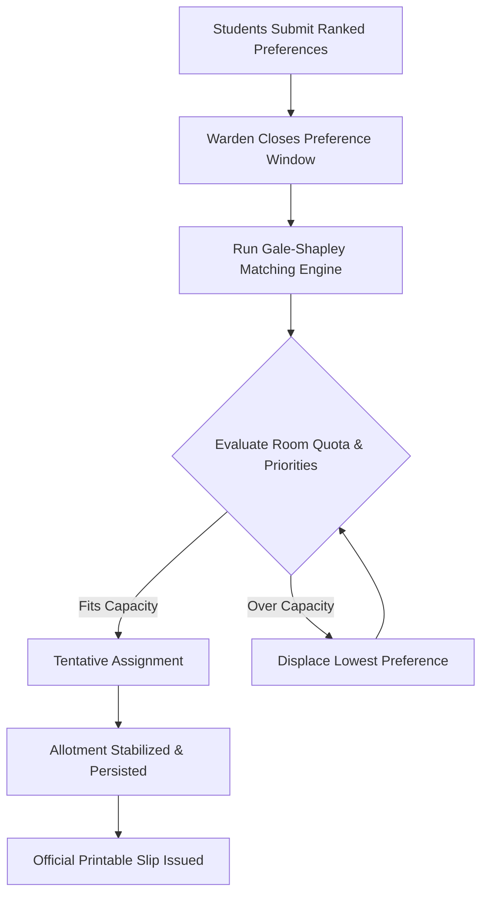
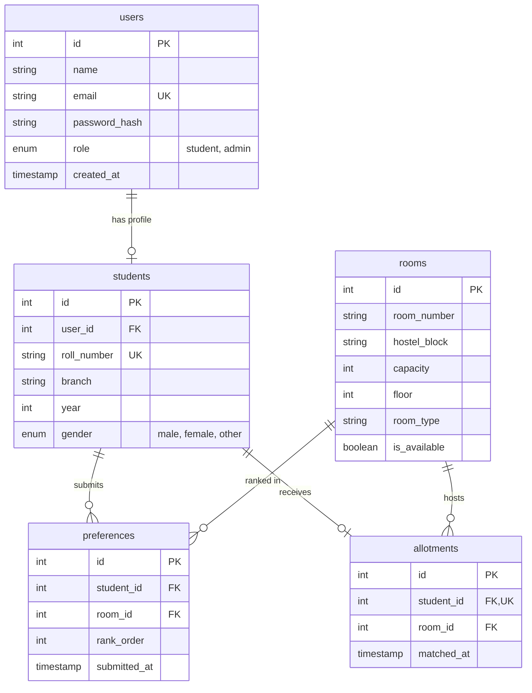

# 🏨 NIT Agartala - Automated Hostel Room Allotment System

[](https://nit-a-hostel-allotment.netlify.app)
[](https://hostel-backend-waoa.onrender.com)
[](https://react.dev/)
[](https://tailwindcss.com/)
[](https://nodejs.org/)
[](https://www.mysql.com/)

> A full-stack, algorithm-driven residence hall allocation portal engineered for **National Institute of Technology Agartala (NIT Agartala)** for the **R.N. Tagore (RNT) Hostel**. It replaces unfair first-come-first-served queues with a transparent, Pareto-optimal **Gale-Shapley Stable Matching Algorithm**.

---

## 🌐 Live Deployments

- 🖥️ **Live Web Application:** [https://nit-a-hostel-allotment.netlify.app](https://nit-a-hostel-allotment.netlify.app)
- ⚙️ **Production API (Render):** [https://hostel-backend-waoa.onrender.com](https://hostel-backend-waoa.onrender.com)

---

## 🌟 Key Features

### 🎓 1. Student Portal
- **Interactive Room Directory:** Real-time browsing of 29+ rooms across **5 Blocks (Block A to Block E)** and **5 Floors (Floor 1 to Floor 5)** with instant availability badges.
- **Dynamic Filters:** Filter rooms by Block, Floor level (Ground to 5th), and Occupancy Type (Single / Double bed).
- **Preference Priority Ranking:** Rank preferred rooms with one-click Priority Reordering (Move Up / Move Down / Delete).
- **Official Printable Allotment Slip:** Generates an official verified allotment slip certificate with student metadata, room specs, and key-handover checklist (`window.print()` ready).
- **Live Progress Tracker:** 4-stage tracking timeline (Registration $\rightarrow$ Preferences $\rightarrow$ Gale-Shapley $\rightarrow$ Final Allotment).

### 🛡️ 2. Chief Warden Admin Console
- **Live Occupancy Dashboard:** Visual progress meters showing bed capacity vs. occupied beds across Blocks A, B, C, D, and E.
- **One-Click Gale-Shapley Engine:** Executes stable matching with real-time match/unmatched metrics.
- **Allotment Reset Mechanism:** Safely wipe current allotment states without deleting registered student accounts or saved preferences.
- **Student Preferences Inspector:** View student applicants with roll numbers, academic programs, and ordered preference chips.
- **Room Management:** Add new rooms across blocks and floors; delete rooms with foreign-key cascade safety.
- **CSV Data Export:** One-click spreadsheet download of all matched allotments for offline administrative filing.

### 🔒 3. Security & Cloud Architecture
- **Role-Based Access Control (RBAC):** Strict separation of privileges between `student` and `admin` via JWT (JSON Web Tokens).
- **Password Hashing:** Industry-standard `bcrypt` salted password hashing.
- **Cloud Database Keep-Alive:** Connection pooling with TCP keep-alive packets (`enableKeepAlive: true`) preventing idle disconnects on Aiven Cloud MySQL.

---

## 🧠 The Matching Algorithm: Gale-Shapley

Traditional hostel allocation based on manual timing creates server bottlenecks and unfairness. This system implements the **Gale-Shapley Algorithm (Deferred Acceptance / College Admissions Problem)**:



- **Guaranteed Stability:** No student and room will mutually prefer each other over their assigned outcomes.
- **Pareto Optimality:** Students get the highest possible ranked room choice that their priority allows.

---

## 🏗️ System Architecture

```
Hostel_allotment_system/
├── backend/                  # Node.js & Express REST API
│   ├── src/
│   │   ├── config/db.js      # MySQL2 Pool + SSL + Keep-Alive
│   │   ├── controllers/      # Auth, Rooms, Preferences, Matching, Allotments
│   │   ├── middleware/       # JWT Bearer Token verification
│   │   ├── routes/           # Express Route definitions
│   │   ├── utils/            # Gale-Shapley algorithm implementation
│   │   └── index.js          # Express entry point
│   └── package.json
│
└── frontend/                 # React 19 + Vite + Tailwind CSS
    ├── src/
    │   ├── pages/            # Modular Component Architecture
    │   │   ├── Login.jsx           # Split-screen hero sign-in
    │   │   ├── Register.jsx        # Split-screen hero sign-up
    │   │   ├── StudentDashboard.jsx# Student layout wrapper with sub-routes
    │   │   ├── RoomList.jsx        # Room browsing & filter grid
    │   │   ├── PreferenceForm.jsx  # Priority ranking & reordering
    │   │   ├── MyAllotment.jsx     # Verified printable allotment slip
    │   │   ├── AdminDashboard.jsx  # Admin layout wrapper with sub-routes
    │   │   ├── AdminOverview.jsx   # Block occupancy analytics
    │   │   ├── AdminRooms.jsx      # Inventory table without rent
    │   │   ├── AddRoom.jsx         # Room registration form
    │   │   ├── AdminStudents.jsx   # Applicant preference inspector
    │   │   └── AdminResults.jsx    # Algorithmic allotment & CSV export
    │   ├── App.jsx           # Nested React Router v7 configuration
    │   └── index.css         # Tailwind typography base
    ├── netlify.toml          # Netlify SPA rewrite rules
    └── package.json
```

---

## 🗄️ Database Schema



---

## 🛠️ Tech Stack

| Layer | Technology |
| :--- | :--- |
| **Frontend** | React 19, Vite, Tailwind CSS 3, React Router v7 |
| **Backend** | Node.js, Express.js, REST APIs |
| **Database** | MySQL 8.0 (Hosted on Aiven Cloud) |
| **Authentication** | JSON Web Tokens (JWT), Bcrypt |
| **Algorithm** | Gale-Shapley Stable Matching |
| **Deployments** | Netlify (Frontend SPA), Render (Backend Web Service) |

---

## 🚀 Local Development Setup

### 1. Clone the Repository
```bash
git clone https://github.com/your-username/Hostel_allotment_system.git
cd Hostel_allotment_system
```

### 2. Backend Setup
```bash
cd backend
npm install
```

Create a `.env` file inside `backend/`:
```env
PORT=5000
DB_HOST=your-mysql-host.aivencloud.com
DB_PORT=your-mysql-port
DB_USER=your-db-username
DB_PASSWORD=your-db-password
DB_NAME=defaultdb
JWT_SECRET=your_super_secret_jwt_key
```

Run the backend server:
```bash
npm run dev
# Server running on port 5000
```

### 3. Frontend Setup
```bash
cd ../frontend
npm install
```

Create a `.env` file inside `frontend/`:
```env
VITE_API_URL=http://localhost:5000
```

Run the frontend development server:
```bash
npm run dev
# Local: http://localhost:5173
```

---

## 📡 API Reference Summary

| Method | Endpoint | Auth | Description |
| :--- | :--- | :---: | :--- |
| `POST` | `/api/auth/register` | No | Register new student/admin account |
| `POST` | `/api/auth/login` | No | Authenticate user & issue JWT |
| `GET` | `/api/rooms` | No | Retrieve all hostel rooms |
| `POST` | `/api/rooms` | JWT | Add a room (Admin only) |
| `DELETE`| `/api/rooms/:id` | JWT | Remove room with FK cleanup |
| `POST` | `/api/preferences` | JWT | Submit/overwrite student preferences |
| `GET` | `/api/preferences/my` | JWT | Retrieve current student preferences |
| `POST` | `/api/match/run` | JWT | Execute Gale-Shapley matching |
| `POST` | `/api/match/reset` | JWT | Reset all active allotments |
| `GET` | `/api/allotments/my` | JWT | View student verified allotment slip |
| `GET` | `/api/allotments/admin-students` | JWT | Retrieve students with ranked choices |

---

## 📜 License
This project is open-source and available under the [MIT License](LICENSE).

---

## 🏛️ Acknowledgements
- **National Institute of Technology Agartala (NIT Agartala)**
- **R.N. Tagore (RNT) Hall of Residence**
- Built with ❤️ for fair, transparent campus living.
